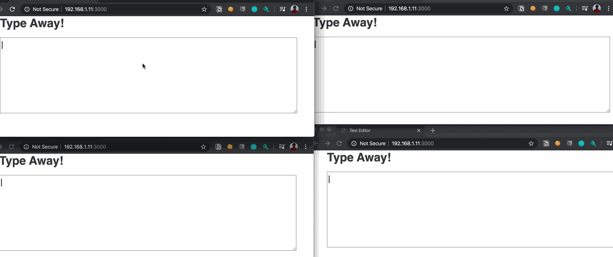

# What's this?
Conflict Free Replication Data Types (CRDTs), are a type of data structures that can be updates and used in a distriubted fashion without having a need for extensive synchronization and consensus.
This is P2P collab editor, much like a very basic version of Google docs. 

# Setting it up!

1. Clone the repo.
2. Go to the server folder.
3. Run "HOST_IP=<local_ip_address> docker-compose up --build"
4. The Editor can be opened on your browser on <local_ip_address>:3000

# Demo

